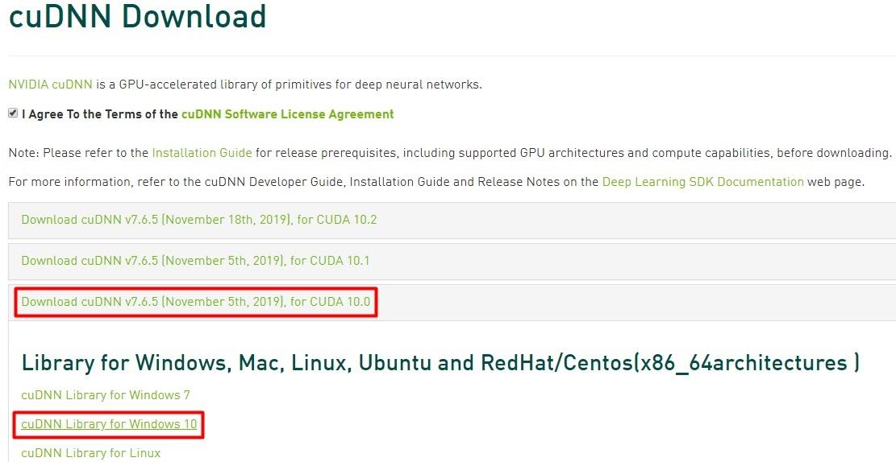
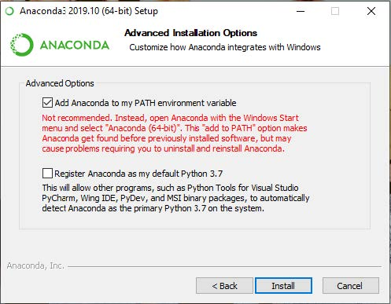
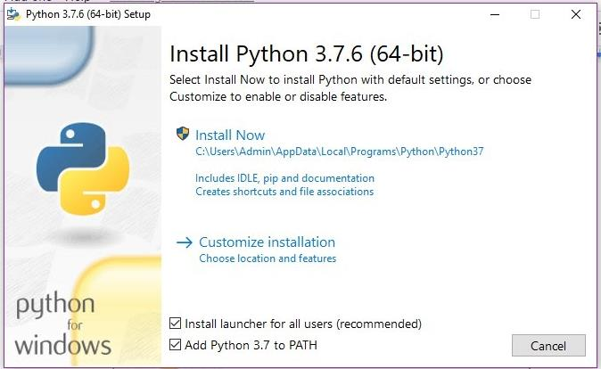
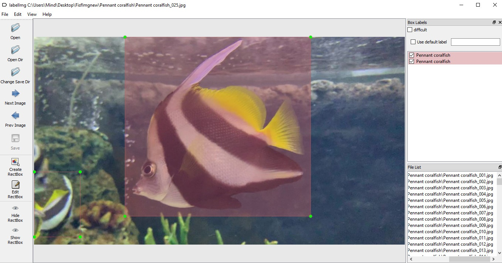
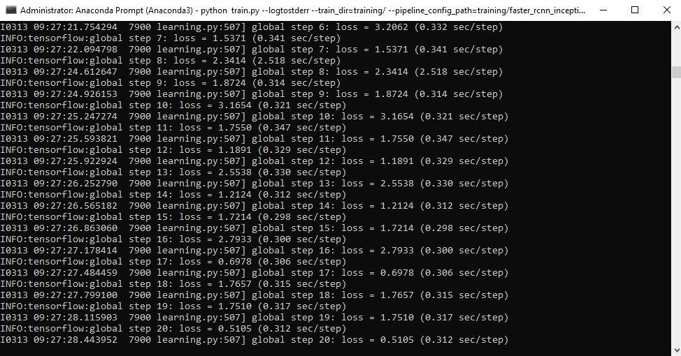
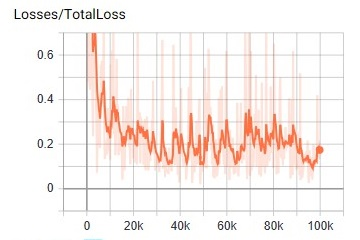
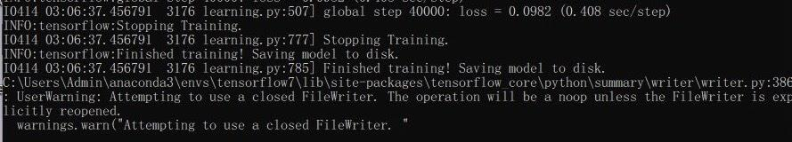
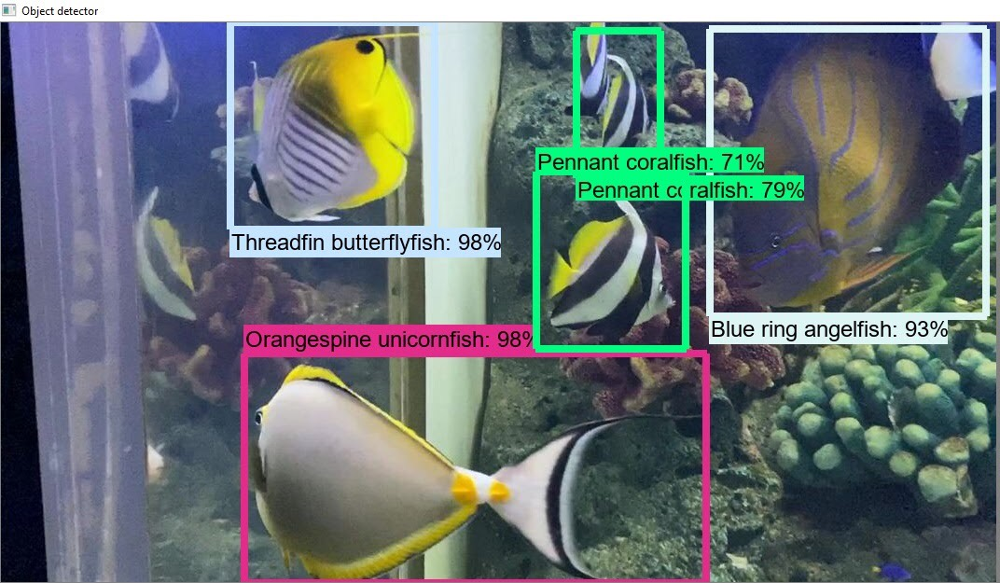

# Fish Recognition Tutorial Tensorflow Faster RCNN windows10

## แนะนำ
สวัสดีค่ะ GitHub นี้จะอธิบายถึงการทำ Object Detection โดยใช้ Tensorflow Faster R-CNN model โดยตัวอย่างที่ใช้ทดสอบจะเป็นการทำ Fish Recognition โดยใช้ระบบปฏิบัติการบน Windows และใช้ GPU ในการประมวลผล

*ขอบคุณ ที่มา : การติดตั้งโปรแกรมจาก [Jeff Heaton](https://youtu.be/qrkEYf-YDyI) และการทำ Tensorflow จาก [EdjeElectronics](https://github.com/EdjeElectronics/TensorFlow-Object-Detection-API-Tutorial-Train-Multiple-Objects-Windows-10)*
 
**วีดีโอการสอนทำเกี่ยวกับ Object Detection**

[](https://www.youtube.com/watch?v=Rgpfk6eYxJA)

สามารถอธิบายขั้นตอนการทำ Tensorflow ได้ดังต่อไปนี้ :
1. [ติดตั้งโปรแกรม](https://github.com/pmgif/Fish-Recognition-Tutorial-Tensorflow-Faster-RCNN-windows10#1-ติดตั้งโปรแกรม)
2. [ตั้งค่า TensorFlow Directory และ Anaconda](https://github.com/pmgif/Fish-Recognition-Tutorial-Tensorflow-Faster-RCNN-windows10#2-ตั้งค่า-TensorFlow-Directory-และ-Anaconda)
3. [ตีกรอบภาพ](https://github.com/pmgif/Fish-Recognition-Tutorial-Tensorflow-Faster-RCNN-windows10#3-ตีกรอบภาพ)
4. [ตั้งค่า Anaconda ใหม่](https://github.com/pmgif/Fish-Recognition-Tutorial-Tensorflow-Faster-RCNN-windows10#4-ตั้งค่า-Anaconda-ใหม่)
5. [กำหนด PYTHONPATH](https://github.com/pmgif/Fish-Recognition-Tutorial-Tensorflow-Faster-RCNN-windows10#5-กำหนด-PYTHONPATH)
6. [ประมวลผล Protobufs และ setup.py](https://github.com/pmgif/Fish-Recognition-Tutorial-Tensorflow-Faster-RCNN-windows10#6-ประมวลผล-Protobufs-และ-setup.py)
7. [ตั้งค่าแบบฝึกสอน(1)](https://github.com/pmgif/Fish-Recognition-Tutorial-Tensorflow-Faster-RCNN-windows10#7-ตั้งค่าแบบฝึกสอน(1))
8. [สร้าง Label Map](https://github.com/pmgif/Fish-Recognition-Tutorial-Tensorflow-Faster-RCNN-windows10#8-สร้าง-Label-Map)
9. [ตั้งค่าแบบฝึกสอน(2)](https://github.com/pmgif/Fish-Recognition-Tutorial-Tensorflow-Faster-RCNN-windows10#9-ตั้งค่าแบบฝึกสอน(2))
10. [ฝึกสอนแบบจำลอง](https://github.com/pmgif/Fish-Recognition-Tutorial-Tensorflow-Faster-RCNN-windows10#10-ฝึกสอนแบบจำลอง)
11. [Export Inference Graph](https://github.com/pmgif/Fish-Recognition-Tutorial-Tensorflow-Faster-RCNN-windows10#11-Export-Inference-Graph)
12. [ทดสอบแบบจำลอง](https://github.com/pmgif/Fish-Recognition-Tutorial-Tensorflow-Faster-RCNN-windows10#12-ทดสอบแบบจำลอง)

<p align="center">
  
</p>

## ขั้นตอน
### 1. ติดตั้งโปรแกรม

ขั้นตอนนี้เป็นการรวบรวมโปรแกรมต่าง ๆ ที่จำเป็นในการทำ Object Detection

#### 1a. ติดตั้ง Visual Studio
เป็นโปรแกรมพื้นฐาน และส่วน Integrated Development Environment เป็นส่วนที่จำเป็นในการติดตั้ง CUDA สามารถดาวน์โหลดได้โดยเข้าเว็บไซต์ [Visual Studio](https://visualstudio.microsoft.com/downloads/) จากนั้นทำการติดตั้งโปรแกรม

#### 1b. ดาวน์โหลด Setup Script
ดาวน์โหลดไฟล์ [tensorflow-gpu.yml](https://www.dropbox.com/s/c7krpl8cp510ath/tensorflow-gpu.yml?dl=1)

#### 1c. ติดตั้ง Driver Graphics
ลง Driver ให้ตรงกับ GPU ที่ใช้ และติดตั้งโปรแกรม โดยดาวน์โหลดได้จากเว็บไซต์ [Driver Graphics](https://www.nvidia.com/Download/index.aspx?lang=th)

#### 1d. ติดตั้ง CUDA 10.0
เราจะใช้ในการประมวลผล GPU สามารถดาวน์โหลดได้จากเว็บไซต์ [CUDA](https://developer.nvidia.com/cuda-10.0-download-archive) เลือกเวอร์ชันดังภาพ
<p align="center">
  
</p>

#### 1e. ติดตั้ง cuDNN 7.6.5
cuDNN เป็นซอฟต์แวร์เสริมของ CUDA ดังนั้นจึงต้องเลือกเวอร์ชันของ cuDNN ให้สอดคล้องกับ [CUDA](https://github.com/pmgif/Fish-Recognition-Tutorial-Tensorflow-Faster-RCNN-windows10#1d-ติดตั้ง-cuda-100) ที่ทำการใช้ โดยสามารถดาวน์โหลดได้จากเว็บไซต์ [cuDNN](https://developer.nvidia.com/cudnn) เลือกเวอร์ชันดังภาพ จากนั้นทำการ Set Path
<p align="center">
  
</p>

```
SET PATH=C:\Program Files\NVIDIA GPU Computing Toolkit\CUDA\v10.0\bin; 
SET PATH=C:\Program Files\NVIDIA GPU Computing Toolkit\CUDA\v10.0\extras\CUPTI\libx64; 
SET PATH=C:\Program Files\NVIDIA GPU Computing Toolkit\CUDA\v10.0\include; 
SET PATH=C:\tools\cuda\bin;
```

#### 1f. ติดตั้ง Anaconda 3.7
จะใช้โปรแกรมนี้ในการเขียนโปรแกรม โดยสามารถดาวน์โหลดได้จากเว็บไซต์ [Anaconda](https://www.anaconda.com/distribution/) และติดตั้งโปรแกรม จากนั้นทำการตั้งค่าดังรูปภาพ
<p align="center">
  
</p>

#### 1g. ติดตั้ง TensorRT 5.0 GA for Windows
TensorRT เป็นซอฟต์แวร์ที่จะช่วยปรับปรุงประสิทธิภาพการรู้จำวัตถุ (Object Detection) สามารถดาวน์โหลดได้จากเว็บไซต์ [TensorRT](https://developer.nvidia.com/tensorrt) และติดตั้งโปรแกรม จากนั้นทำการ Set Path ที่อยู่ของโปรแกรม TensorRT

#### 1h. ติดตั้ง Miniconda3 Python 3.7 for Windows 64-bit
Miniconda3 เป็นส่วนหนึ่งของ Anaconda ซึ่งเป็นเฟรมเวิร์คสำหรับการทำ data science สำหรับภาษาไพทอน สามารถดาวน์โหลดได้จากเว็บไซต์ [Miniconda3](https://docs.conda.io/en/latest/miniconda.html) ทำการดาวน์โหลดและติดตั้งโปรแกรม

#### 1i. ติดตั้ง Python 3.7.6
เป็นโปรแกรมที่ใช้เขียนภาษา Python โดยภาษา Python จะนำมาใช้ในส่วนของการเขียนคำสั่งในการประมวลผล Object Detection สามารถดาวน์โหลดได้จากเว็บไซต์ [Python](https://www.python.org/downloads/) และติดตั้งโปรแกรม จากนั้นทำการตั้งค่าดังรูปภาพ
<p align="center">
  
</p>

#### 1j. ติดตั้ง Jupyter
เปิดใช้งานโปรแกรม Command Prompt และพิมพ์คำสั่ง
```
C:\Users\gif> conda install jupyter
```

#### 1k. ประมวลผล Setup Script
 1. ค้นหาที่อยู่ของไฟล์ .yml
```
C:\Users\gif> dir *.yml
```
 2. สร้าง Environment ของ tensorflow.yml โดยใช้ conda ในการสร้าง
```
C:\Users\gif> conda env create -v -f tensorflow.yml
```

#### 1l. ติดตั้ง Jupyter Kernel
 1. เปิดใช้งาน environment tensorflow โดยใช้ conda ด้วยคำสั่ง
```
C:\Users\gif> Conda activate tensorflow
```
 2. ติดตั้ง Jupyter Kernel ของ python เวอร์ชัน 3.7 ด้วยคำสั่ง
```
(tensorflow) C:\Users\gif> python -m ipykernel install --user --name tensorflow --display-name "Python 3.7 (tensorflow)"
```
 3. ทดลองเขียน python เพื่อทดสอบการใช้งานของ tensorflow
```
(tensorflow) C:\Users\gif> python
```
 4. พิมพ์คำสั่ง python ทีละคำสั่ง
```
>>> import tensorflow as tf
>>> print(tf.__version__)
>>> quit()
```

#### 1m. ทดสอบการทำงานของ Tensorflow
 1. เข้าไปที่ [เว็บไซต์](https://github.com/jeffheaton/t81_558_deep_learning) ทำการดาวน์โหลดไฟล์ทั้งหมด
 2. แตกไฟล์ t81_558_deep_learning-master
 3. เปลี่ยน directory เพื่อเข้าไปใน directory t81_558_deep_learning-master
```
(tensorflow) C:\Users\gif> cd t81_558_deep_learning-master
```
 4. เรียกใช้ jupyter notebook
```
(tensorflow) C:\Users\gif\t81_558_deep_learning-master> jupyter notebook
```
 5. เลือกเปิดไฟล์ โดยใช้บราวเซอร์ชนิดใดก็ได้
 6. เลือกไฟล์ t81_558_class_01_1_overview.ipynb
 7. เปลี่ยนประเภทของ kernel จากเวอร์ชัน 3 เป็นเวอร์ชัน 3.7
 8. ประมวลผล code ดังกล่าว เพื่อเรียกใช้งาน GPU

### 2. ตั้งค่า TensorFlow Directory และ Anaconda

ขั้นตอนนี้เป็นขั้นตอนการตั้งค่าโมเดลสำหรับตรวจจับวัตุ ทำตามขั้นตอนต่อไปนี้ เพื่อไม่ให้เกิดความผิดพลาด

#### 2a. Download TensorFlow Object Detection API repository from GitHub
สร้างโฟลเดอร์ไว้ที่ ไดร์ฟ C โดยตั้งชื่อว่า tensorflow จากนั้นทำการดาวน์โหลด full TensorFlow object detection จาก [Github](https://github.com/tensorflow/models) ทำการแตกไฟล์ และนำไฟล์มาไว้ในโฟลเดอร์ tensorflow จากนั้นทำการเปลี่ยนชื่อจาก “models-master” to just “models”.

#### 2b. Download the Faster-RCNN-Inception-V2-COCO model from TensorFlow's model zoo
ดาวน์โหลด Tensorflw model ได้จาก [model zoo](https://github.com/tensorflow/models/blob/master/research/object_detection/g3doc/detection_model_zoo.md) ซึ่งมีหลายโมเดลให้เลือก แต่เราได้เลือกใช้ Faster-RCNN-Inception-V2 model ซึ่งสามารถดาวน์โหลดโดยตรงได้จาก [Faster R-CNN](https://www.dropbox.com/s/nrp2xp3bk71zzje/faster_rcnn_inception_v2_coco_2018_01_28.tar.gz?dl=1) จากนั้นทำการแตกไฟล์ แล้วนำไปใส่ไว้ใน C:\tensorflow\models\research\object_detection

#### 2c. Download this tutorial's repository from GitHub
ดาวน์โหลดตัว model เพิ่มเติมได้จาก repository นี้ จากนั้นนำไฟล์ไปไว้ที่โฟลเดอร์ C:\tensorflow\models\research\object_detection *(เนื่องจากมีไฟล์ซ้ำ ให้ทำการซ้อนทับไฟล์เดิมไปได้เลย ดังภาพ)*

<p align="center">
  
</p>

นอกจากนี้คุณยังสามารถดาวน์โหลด frozen inference graph สำหรับ Fish Recognition ที่ผ่านการ Train ของเรา [จากลิงก์ Dropbox นี้] (https://www.dropbox.com/s/va9ob6wcucusse1/inference_graph.zip?dl=1) และแยกเนื้อหาไปที่ \ object_detection \ inference_graph โดย inference graph นี้จะมีรอบการทำงาน คุณสามารถทดสอบได้หลังจากคำแนะนำการตั้งค่าทั้งหมดในขั้นตอนที่ 2a - 2f เสร็จสมบูรณ์โดยเรียกใช้สคริปต์ Object_detection_image.py (หรือวิดีโอหรือเว็บแคม)

จากนั้นทำตามขั้นตอนย่อยต่อไปนี้ (ห้ามลบโฟลเดอร์ดังกล่าว):
- ลบทุกไฟล์จากโฟลเดอร์ \object_detection\training
-	ลบทุกไฟล์จากโฟลเดอร์ \object_detection\inference_graph
- ลบไฟล์ “test_labels.csv” และ “train_labels.csv” จาก \object_detection\images
- ลบไฟล์ในโฟลเดอร์ \object_detection\images\train และ \object_detection\images\test (หากต้องการใช้ภาพของตนเองในการทดสอบ แต่หากต้องการใช้ภาพปลาในการทดสอบ สามารถดาวน์โหลดได้จาก [dropbox](https://www.dropbox.com/sh/fmbncuvsjg75mkv/AAAb4B9rs6w4jyNeuao-SGxva?dl=1) ของฉัน)

### 3.ตีกรอบภาพ

ทำการตีกรอบภาพ เพื่อให้ได้ไฟล์ .xml โดยเราจะใช้โปรแกรม LabelImg ซึ่งสามารถศึกษาโปรแกรมเพิ่มเติมได้จาก [LabelImg GitHub link](https://github.com/tzutalin/labelImg) หรือจะดาวน์โหลดโดยตรงได้จาก [LabelImg download link](https://www.dropbox.com/sh/sryfvbr43efumr5/AAD3Af7D7cgUePbTh6E_ppPga?dl=1) โดยเราจะใช้เวอร์ชัน 1.6 ในการตีกรอบภาพ

จากนั้นทำการตีกรอบภาพ ดังรูปภาพ

<p align="center">
  
</p>

### 4. ตั้งค่า Anaconda ใหม่
เปิดโปรแกรม Anaconda Prompt โดยคลิกขวาเลือกเป็น “Run as Administrator”

พิมพ์คำสั่งเพื่อสร้าง virtual environment ขึ้นมาใหม่ โดยตั้งชื่อว่า tensorflow1 พร้อมกับติดตั้ง python เวอร์ชัน 3.7
```
C:\> conda create -n tensorflow1 pip python=3.7
```
จากนั้น เปิดใช้งาน environment ด้วยคำสั่ง
```
C:\> activate tensorflow1
```
อัปเดทเวอร์ชันของ pip จากเวอร์ชัน pip 10.0.1 เป็นเวอร์ชันล่าสุด
```
(tensorflow1) C:\>python -m pip install --upgrade pip
```
ติดตั้ง tensorflow-gpu เวอร์ชัน 1.15 ด้วยคำสั่งดังนี้ *(เนื่องจากเวอร์ชัน tensorflow-gpu ที่ลงตอนติดตั้ง jupyter เป็นเวอร์ชัน 2.0.0 ไม่สามารถใช้ทดสอบได้ จึงเปลี่ยนเป็น tensorflow-gpu เวอร์ชัน 1.15 สามารถพิมพ์คำสั่งลงไปได้เลย เนื่องจากตัวโปรแกรมจะถอนการติดตั้ง tensorflow-gpu เวอร์ชัน 2.0.0 ให้อัตโนมัติ)*
```
(tensorflow1) C:\> pip install --ignore-installed --upgrade tensorflow-gpu==1.15
```
ติดตั้งแพคเกจย่อยอื่น ๆ ด้วยคำสั่ง
```
(tensorflow1) C:\> conda install -c anaconda protobuf
(tensorflow1) C:\> pip install pillow
(tensorflow1) C:\> pip install lxml
(tensorflow1) C:\> pip install Cython
(tensorflow1) C:\> pip install contextlib2
(tensorflow1) C:\> pip install jupyter
(tensorflow1) C:\> pip install matplotlib
(tensorflow1) C:\> pip install pandas
(tensorflow1) C:\> pip install opencv-python
```

### 5. กำหนด PYTHONPATH
กำหนด PYTHONPATH
```
(tensorflow1) C:\> set PYTHONPATH=C:\tensorflow1\models;C:\tensorflow1\models\research;C:\tensorflow1\models\research\slim
```
สามารถตรวจสอบ PYTHONPATH จากคำสั่ง
```
(tensorflow1) C:\> echo %PYTHONPATH%
```

### 6. ประมวลผล Protobufs และ setup.py

เปลี่ยน directories จากคำสั่ง
```
(tensorflow1) C:\> cd C:\tensorflow1\models\research
```
Tensorflow ใช้ Protobuf เพื่อกำหนดค่าแบบจำลองและพารามิเตอร์ของการฝึกสอนแบบจำลอง โดยสิ่งนี้จะสร้างไฟล์ name_pb2.py ไว้ในโฟลเดอร์ \ object_detection \ protos
```
protoc --python_out=. .\object_detection\protos\anchor_generator.proto .\object_detection\protos\argmax_matcher.proto .\object_detection\protos\bipartite_matcher.proto .\object_detection\protos\box_coder.proto .\object_detection\protos\box_predictor.proto .\object_detection\protos\eval.proto .\object_detection\protos\faster_rcnn.proto .\object_detection\protos\faster_rcnn_box_coder.proto .\object_detection\protos\grid_anchor_generator.proto .\object_detection\protos\hyperparams.proto .\object_detection\protos\image_resizer.proto .\object_detection\protos\input_reader.proto .\object_detection\protos\losses.proto .\object_detection\protos\matcher.proto .\object_detection\protos\mean_stddev_box_coder.proto .\object_detection\protos\model.proto .\object_detection\protos\optimizer.proto .\object_detection\protos\pipeline.proto .\object_detection\protos\post_processing.proto .\object_detection\protos\preprocessor.proto .\object_detection\protos\region_similarity_calculator.proto .\object_detection\protos\square_box_coder.proto .\object_detection\protos\ssd.proto .\object_detection\protos\ssd_anchor_generator.proto .\object_detection\protos\string_int_label_map.proto .\object_detection\protos\train.proto .\object_detection\protos\keypoint_box_coder.proto .\object_detection\protos\multiscale_anchor_generator.proto .\object_detection\protos\graph_rewriter.proto .\object_detection\protos\calibration.proto .\object_detection\protos\flexible_grid_anchor_generator.proto
```
คำสั่งการรวบรวมไฟล์ protoc แบบสั้นที่สำหรับการติดตั้ง Object Detection API ของ TensorFlow นั้น ไม่สามารถทำงานบน Windows ได้ ดังนั้นไฟล์ .proto ทุกไฟล์ในไดเร็กทอรี \ object_detection \ protos จึงต้องถูกเรียกใช้โดยคำสั่งทีละรายการ
```
(tensorflow1) C:\tensorflow1\models\research> python setup.py build
(tensorflow1) C:\tensorflow1\models\research> python setup.py install
```

### 7. ตั้งค่าแบบฝึกสอน(1)

สร้าง TFRecords ที่ทำหน้าที่เป็นข้อมูลป้อนเข้าในรูปแบบการฝึกอบรม TensorFlow ขั้นตอนนี้จะใช้สคริปต์ xml_to_csv.py และ generate_tfrecord.py จากชุดข้อมูล โดยทำการแก้ไขเล็กน้อยเพื่อให้ทำงานกับโครงสร้างไดเรกทอรีของเรา

เปลี่ยน directories จากคำสั่งดังนี้
```
(tensorflow1) C:\tensorflow1\models\research> cd object_detection
```
นำไฟล์ข้อมูลภาพ .xml ที่มีข้อมูลทั้งหมดในแฟ้มข้อมูล train และ test ไปแปลงไฟล์เพื่อสร้างไฟล์ .csv
```
(tensorflow1) C:\tensorflow1\models\research\object_detection> python xml_to_csv.py
```
แก้ไขไฟล์ generate_tfrecord.py จากโฟลเดอร์ \object_detection เพื่อระบุ label map ของตัวรูปแบบจำลอง
```
# TO-DO replace this with label map
def class_text_to_int(row_label):
    if row_label == 'Pennant coralfish':
        return 1
    elif row_label == 'Moon wrasse':
        return 2
    elif row_label == 'Sapphire devil':
        return 3
    elif row_label == 'Black-backed butterflyfish':
        return 4
    elif row_label == 'Blue ring angelfish':
        return 5
    elif row_label == 'Threadfin butterflyfish':
        return 6
    elif row_label == 'Bluesteak cleaner wrasse':
        return 7
    elif row_label == 'Orangespine unicornfish':
        return 8
    else:
        return 0
```
หรือจะเปลี่ยนตาม format ที่ให้ไว้ดังกล่าว เพื่อนำไปประยุกต์ใช้กับไฟล์ของตัวเอง
```
# TO-DO replace this with label map
def class_text_to_int(row_label):
    if row_label == 'Name1':
        return 1
    elif row_label == 'Name2':
        return 2
    else:
        return 0
```
สร้างไฟล์ TFRecord ของ train.record และ test.record ใน \ object_detection เพื่อใช้ในการฝึกสอนแบบจำลองการตรวจจับวัตถุใหม่ โดยใช้คำสั่งดังนี้
```
python generate_tfrecord.py --csv_input=images\train_labels.csv --image_dir=images\train --output_path=train.record
python generate_tfrecord.py --csv_input=images\test_labels.csv --image_dir=images\test --output_path=test.record
```

### 8. สร้าง Label Map
สร้างไฟล์ labelmap.pbtxt ลงในโฟลเดอร์ C: \ tensorflow1 \ models \ research \ object_detection \ training เพื่อกำหนดว่าแต่ละวัตถุคืออะไร โดยกำหนดชื่อคลาสและหมายเลข ID คลาส ให้ตรงกับชื่อคลาสและหมายเลข ID ของไฟล์ generate_tfrecord.py
```
item {
  id: 1
  name: 'Pennant coralfish'
}

item {
  id: 2
  name: 'Moon wrasse'
}

item {
  id: 3
  name: 'Sapphire devil'
}

item {
  id: 4
  name: 'Black-backed butterflyfish'
}

item {
  id: 5
  name: 'Blue ring angelfish'
}

item {
  id: 6
  name: 'Threadfin butterflyfish'
}

item {
  id: 7
  name: 'Bluesteak cleaner wrasse'
}

item {
  id: 8
  name: 'Orangespine unicornfish'
}
```
หรือจะเปลี่ยนตาม format ที่ให้ไว้ดังกล่าว เพื่อนำไปประยุกต์ใช้กับไฟล์ของตัวเอง
```
item {
  id: 1
  name: 'Name1'
}

item {
  id: 2
  name: 'Name2'
}
```

### 9. ตั้งค่าแบบฝึกสอน(2)
คัดลอกไฟล์ faster_rcnn_inception_v2_pets.config จาก C: \ tensorflow1 \ models \ research \ object_detection \ samples \ configs ไปยัง \ object_detection \ training จากนั้นเปิดไฟล์ด้วยโปรแกรม notepad++ และแก้ไข code ซึ่งมีการเปลี่ยนแปลงหลายอย่างในไฟล์ .config

- บรรทัดที่ 9 เปลี่ยน num_classes (จำนวนของวัตถุต่าง ๆ ที่ต้องการให้ตัวแยกประเภทตรวจจับ) ในการฝึกสอนแบบจำลองมีจำนวนปลาที่ถูกนำมาฝึกสอนแบบจำลองทั้งหมด 8 สายพันธ์ุ
```
num_classes: 8
```
- บรรทัดที่ 106 เปลี่ยนที่อยู่ของ fine_tune_checkpoint ดังนี้
```
fine_tune_checkpoint : "C:/tensorflow1/models/research/object_detection/faster_rcnn_inception_v2_coco_2018_01_28/model.ckpt"
```
- บรรทัดที่ 116 เปลี่ยนจำนวนรอบการฝึกสอนแบบจำลอง
```
num_steps: 100000
```
- บรรทัดที่ 123 และ 125 ในส่วน train_input_reader เปลี่ยน input_path และ label_map_path
```
input_path : "C:/tensorflow1/models/research/object_detection/train.record"
```
```
label_map_path: "C:/tensorflow1/models/research/object_detection/training/labelmap.pbtxt"
```
- บรรทัดที่ 130 เปลี่ยน num_examples เป็นจำนวนภาพที่มีในแฟ้มข้อมูล \ images \ test
```
num_examples: 1600
```
- บรรทัดที่ 135 และ 137 ในส่วน eval_input_reader เปลี่ยน input_path และ label_map_path ดังนี้
```
input_path : "C:/tensorflow1/models/research/object_detection/test.record"
```
```
label_map_path: "C:/tensorflow1/models/research/object_detection/training/labelmap.pbtxt"
```

จากนั้นทำการบันทึกไฟล์ที่ทำการแก้ไขข้อมูล

### 10. ฝึกสอนแบบจำลอง
ย้ายไฟล์ train.py ที่อยู่ในแฟ้มข้อมูล / object_detection / legacy ไปที่แฟ้มข้อมูล / object_detection

พิมพ์คำสั่งเพื่อฝึกสอนแบบจำลอง
```
python train.py --logtostderr --train_dir=training/ --pipeline_config_path=training/faster_rcnn_inception_v2_pets.config
```
TensorFlow จะเริ่มต้นการฝึกสอนแบบจำลอง ดังภาพ
<p align="center">
  
</p>

ระหว่างการฝึกสอนแบบจำลองสามารถดูความก้าวหน้าโดยใช้ TensorBoard โดยคำสั่งนี้จะต้องเปิดในอินสแตนซ์ใหม่ของ Anaconda Prompt และเปิดใช้งาน environment tensorflow1 เปลี่ยนเป็นไดเรกทอรี C: \ tensorflow1 \ models \ research \ object_detection และใช้คำสั่ง
```
(tensorflow1) C:\tensorflow1\models\research\object_detection>tensorboard --logdir=training
```
โดย code ดังกล่าวจะสร้างเว็บเพจบนเครื่องคอมพิวเตอร์ YourPCName: 6006 สามารถดูได้ผ่านเว็บเบราว์เซอร์ หน้า TensorBoard จะให้ข้อมูลและกราฟที่แสดงว่าการฝึกสอนแบบจำลองมีความก้าวหน้าอย่างไร โดยกราฟนี้จะแสดงค่า loss ที่แสดงค่าความแม่นยำของแต่ละภาพในการฝึกสอนแบบจำลอง โดยแกน x หมายถึง ค่า Num Step (รอบการทำงาน) แกน y หมายถึง ค่า loss

<p align="center">
  
</p>

เมื่อการฝึกสอนแบบจำลองเสร็จสิ้น จะแสดงข้อความ “Finished training! Saving model to disk.” ดังภาพ
<p align="center">
  
</p>

### 11. Export Inference Graph
สร้างไฟล์แบบจำลอง (ไฟล์ .pb) จากโฟลเดอร์ \ object_detection โดยที่ “model.ckpt-XXXX” คือหมายเลขสูงสุดของไฟล์ .ckpt ในโฟลเดอร์ \ training
```
python export_inference_graph.py --input_type image_tensor --pipeline_config_path training/faster_rcnn_inception_v2_pets.config --trained_checkpoint_prefix training/model.ckpt-XXXX --output_directory inference_graph
```

### 12. ทดสอบแบบจำลอง
เรียกใช้สคริปต์โดยพิมพ์ลงในพรอมต์คำสั่งของ Anaconda (เมื่อเปิดใช้งาน environment “tensorflow1”) แล้วกด ENTER ซึ่งคำสั่งนี้จะเป็นการเปิด python shell เพื่อเรียกใช้งานสคริปต์ต่าง ๆ
```
(tensorflow1) C:\tensorflow1\models\research\object_detection> idle
```
- เปิดไฟล์ Object_detection_image.py จากแฟ้มข้อมูล \ object_detection
- บรรทัดที่ 50 แก้ไขจำนวน num class ของไฟล์ Object_detection_image.py
```
NUM_CLASSES = 8
```
- แก้ไขชื่อภาพที่ต้องการทดสอบ เมื่อแก้ไขสำเร็จแล้ว กดปุ่ม F5 เพื่อประมวลผลโปรแกรม
```
IMAGE_NAME = 'test1.jpg'
```

ตัวอย่างผลการประมวลผล code จากไฟล์ Object_detection_image.py สำเร็จ ดังภาพ

<p align="center">
  
</p>
